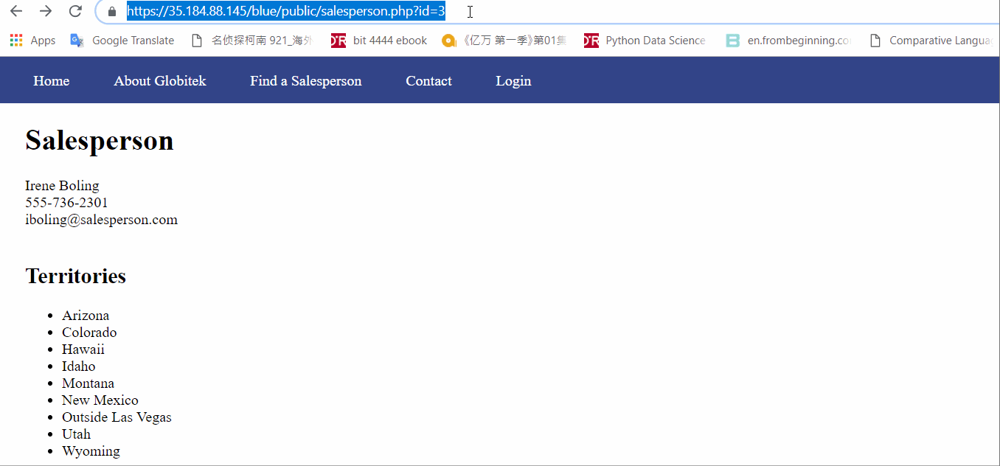
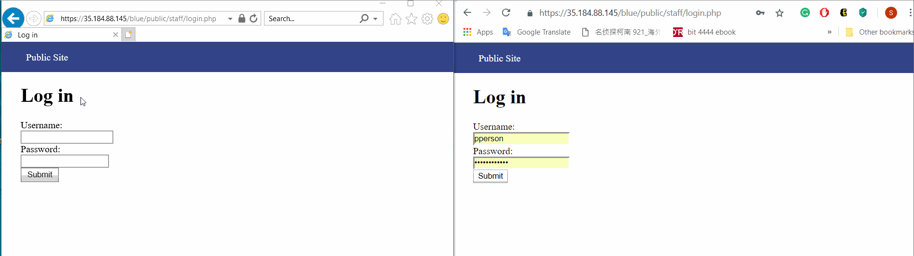
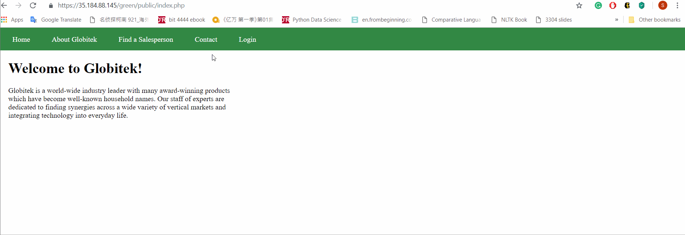
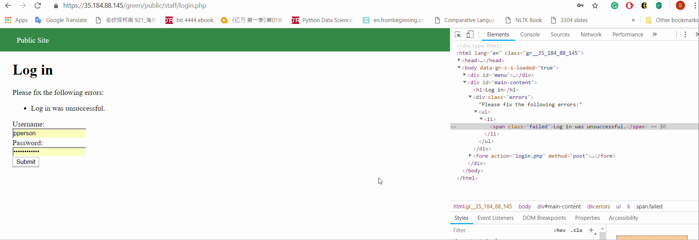
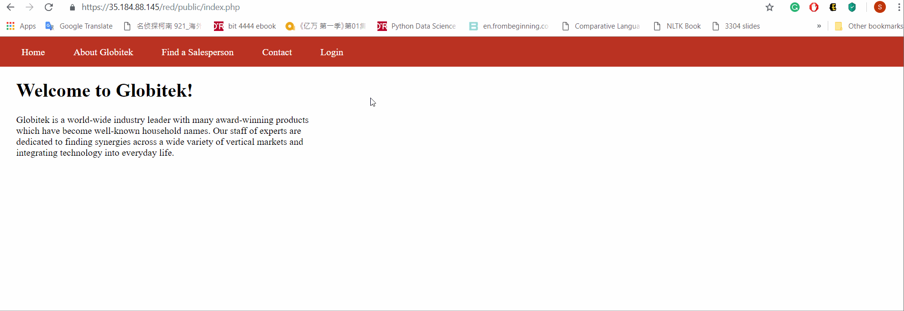
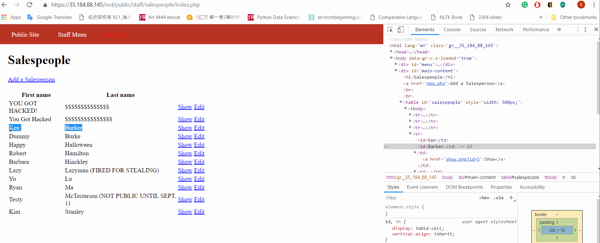

# Project 8 - Pentesting Live Targets

Time spent: 8 hours spent in total

> Objective: Identify vulnerabilities in three different versions of the Globitek website: blue, green, and red.

The six possible exploits are:
* Username Enumeration
* Insecure Direct Object Reference (IDOR)
* SQL Injection (SQLi)
* Cross-Site Scripting (XSS)
* Cross-Site Request Forgery (CSRF)
* Session Hijacking/Fixation

Each version of the site has been given two of the six vulnerabilities. (In other words, all six of the exploits should be assignable to one of the sites.)

## Blue

Vulnerability #1: SQL Injection.

The original url ends with id = 3. I injected another statement (OR sleep(5) = 0) which made the whole statement waited for 5 second to excute.

Vulnerability #2: Session Hijacking

To start with, I opened two windows with different browsers. Then I logged in my account in the first browser, copied and pasted its session id to the second one. Now when I go the staff/index.php on the second browser, it's already logged in without entering username and password.

## Green

Vulnerability #1: Cross-Site Scripting (XSS)

To reproduce: 

Vulnerability #2: Username Enumeration

If a correct username with a wrong password were entered, the class of the error code is "failure". If a wrong username was entered, the class is "failed".

## Red

Vulnerability #1: Insecure Direct Object Reference (IDOR)

Hidden salesman information can be viewed by changing id.

Vulnerability #2: Cross-Site Request Forgery (CSRF)

I created a new website and changed the href of the "show" button to my form, where the firstname and lastname are changed.

